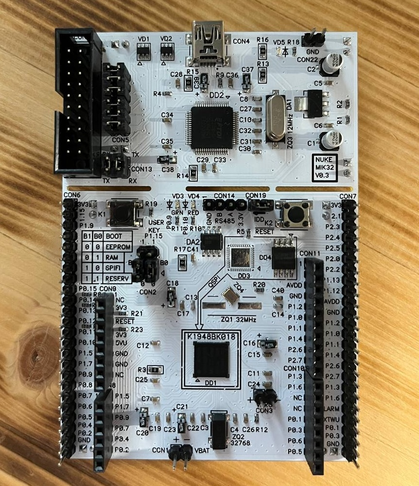

# RISC-V Assembly Language Programming

## Оглавление

<!--toc:start-->
- [Описание](#описание)
- [Как работать с репозиторием](#как-работать-с-репозиторием)
<!--toc:end-->

## Описание

Программирование на языке ассемблера RISC-V / пер. с англ. А. В. Логунова; под науч. ред. А. Ю. Романова. – М.: ДМК Пресс, 2025. – 276 с.: ил. – (Книжная полка Истового инженера)

Репозиторий содержит дополнительные теоретические материалы и практические задания
к книге Стивена Смита "Программирование на языке ассемблера".<br>
Книга продолжает серию «Книжная полка Истового инженера», которая издается при поддержке
компании YADRO.<br>
Издание подготовлено к публикации Московским институтом электроники и математики
им. А. Н. Тихонова НИУ ВШЭ совместно с издательством «ДМК Пресс».

## Как работать с репозиторием

Для клонирования репозитория достаточно выполнить следующую команду:

```bash
git clone https://github.com/mt-omarov/riscv-assembly-programming.git`
```

Репозиторий содержит дополнительные теоретические материалы и исходные коды
практических заданий к каждой главе книги.

Практические задания и примеры кода адаптированы под работу на ОС Ubuntu:22.04
на базе процессора RISC-V в эмулированной среде QEMU.<br>
В некоторых заданиях предлагается использовать отечественный микроконтроллер
MIK32 Амур от компании Mikron.<br>
Правила сборки (Makefile) в таких заданиях составлялись для использования
демонстрационной платы с микроконтроллером К1948ВК018 АМУР.

<p align="center">
    
</p>

Каждая папка соответствует определенной практической работе по теме главы книги
и содержит README файл с описанием файлов, поддиректорий и шагов для выполнения работы.
